# Podcastr

A next-generation iOS podcast player built around an embedded AI agent that has perfect knowledge of every podcast the user is subscribed to — including episodes they have not listened to yet.

> Bootstrapped from [`ios-app-template`](https://github.com/pablofernandez/ios-app-template). The sections below describe the inherited template foundations (shake-to-feedback, agent loop, friends, TestFlight CI). Podcast-specific modules live under `App/Sources/{Audio,Podcast,Transcript,Knowledge,Voice,Briefing}` and the new feature folders under `App/Sources/Features/`.

See [`docs/spec/PRODUCT_SPEC.md`](docs/spec/PRODUCT_SPEC.md) for the full product spec, or [`docs/spec/PROJECT_CONTEXT.md`](docs/spec/PROJECT_CONTEXT.md) for the vision summary. Engineering guidelines (file-size limits, etc.) in [`AGENTS.md`](AGENTS.md).

---

## Screenshots

Real data, captured on the iOS 26.4 simulator (iPhone 17 Pro Max).

### Onboarding & Today

| Welcome | Today (with playback in flight) |
|---------|---------------------------------|
| 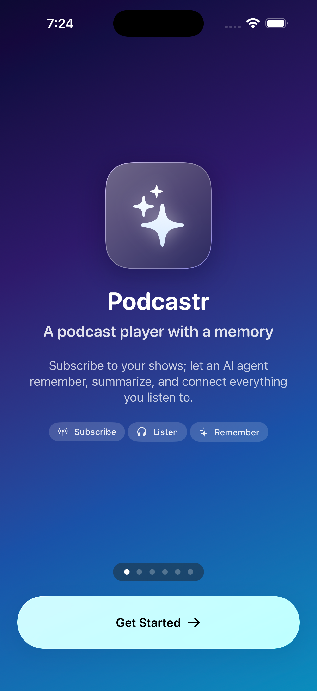 | 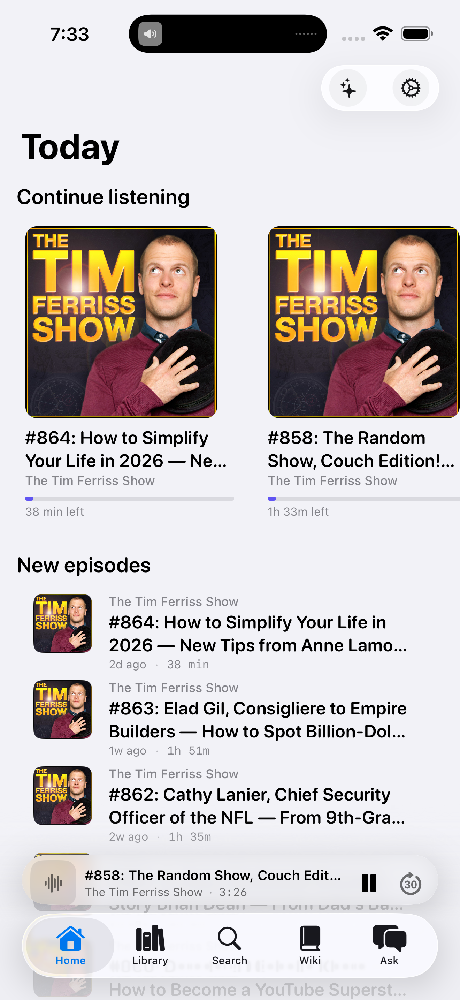 |

### Discover — find shows on Apple Podcasts

| Popular Now (default empty state) | Live search ("tim ferriss") |
|-----------------------------------|-----------------------------|
| 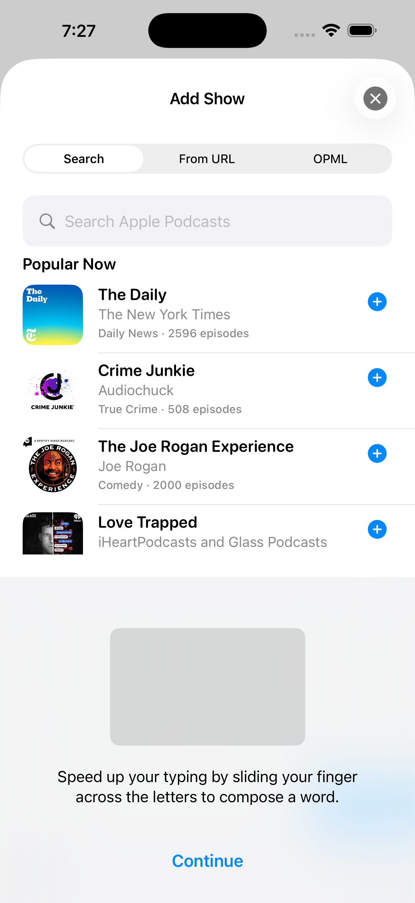 | 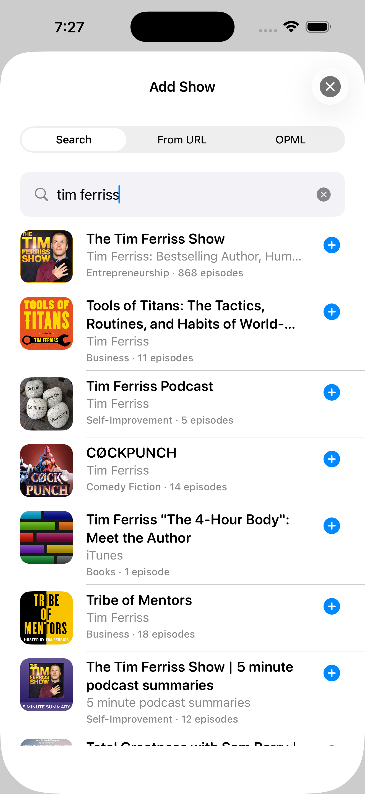 |

The Discover surface is the **Search** segment of *Library → Add Show*. It opens to Apple's top-podcasts feed (two-step pipeline: marketing-tools RSS → batched iTunes lookup), and as you type it debounces and hits the iTunes Search API directly. One-tap subscribe routes through the same `SubscriptionService` as paste-URL / OPML import.

### Library, show detail, episode list

| Library | Show detail | Episode list |
|---------|-------------|--------------|
| 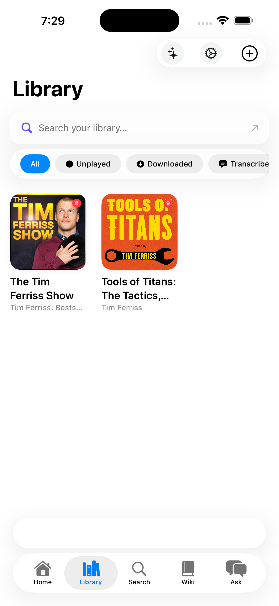 | 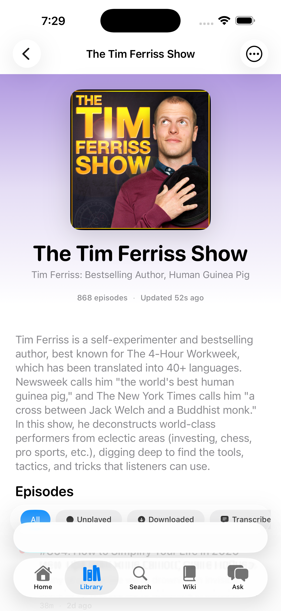 | 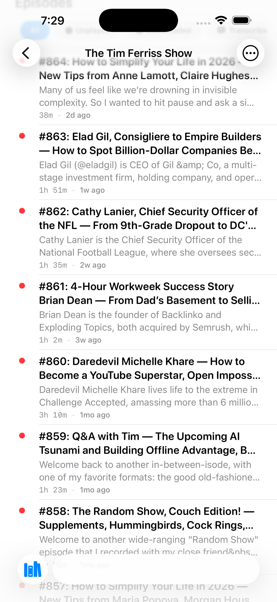 |

### Mini-player + Now Playing

The mini-player adopts iOS 26's `tabViewBottomAccessory` — same pattern as Apple Music. Above the tab bar in the expanded layout; collapses to an inline pill between the active-tab capsule and the trailing toolbar controls when the bar minimizes on scroll-down.

| Mini-player above tab bar | Full Now Playing |
|---------------------------|------------------|
| 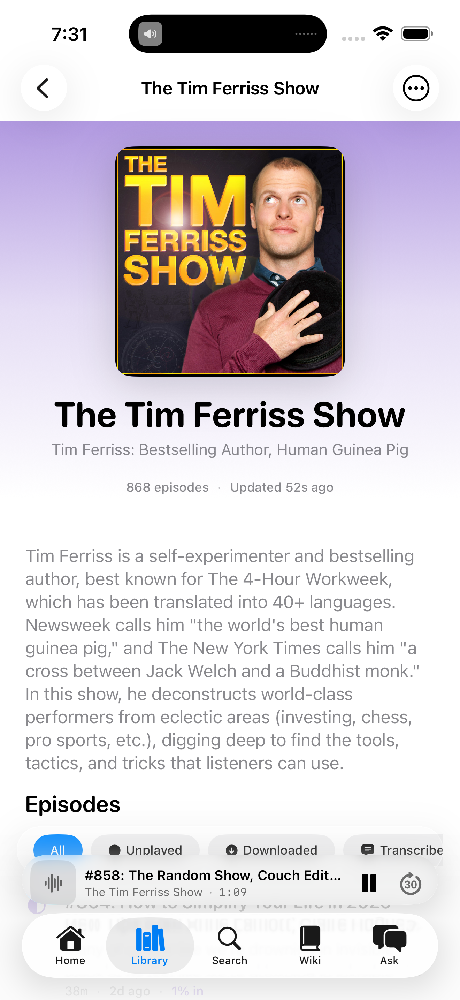 | 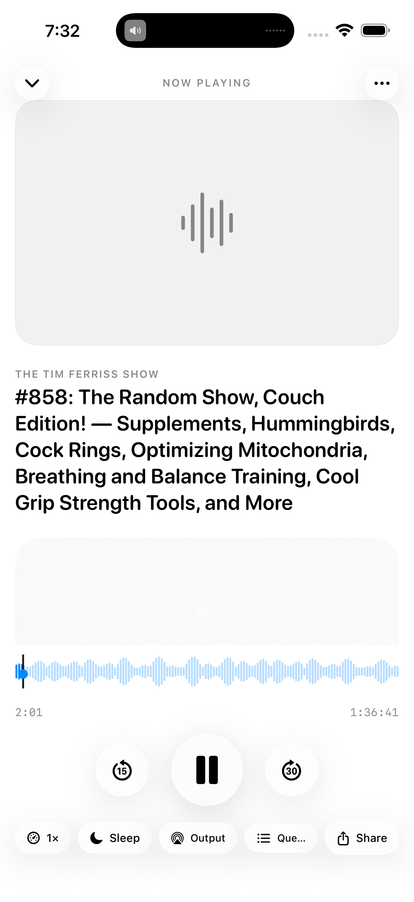 |

### Wiki & Ask the Agent

| Wiki tab | Ask the Agent |
|----------|---------------|
| 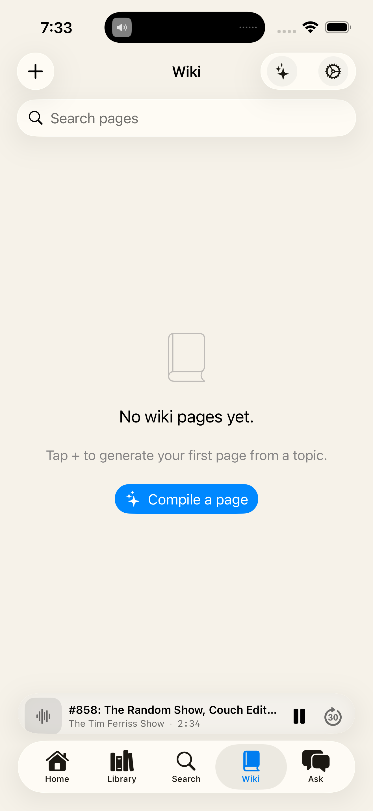 | 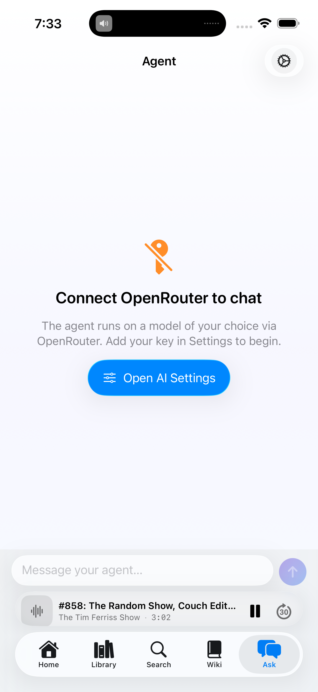 |

---

## Features

### Shake-to-Feedback
Device shake opens a feedback sheet from anywhere in the app. No button needed.

- **Shake once** → feedback compose sheet opens
- **Tap camera icon, then dismiss** → app enters screenshot-capture mode
- **Shake again** → captures the current screen
- **Annotate** → draw red strokes over the screenshot on a full-screen canvas
- **Send** → submits with optional attached annotated image

Implementation lives in:
- `App/Sources/Design/ShakeDetector.swift` — `UIViewControllerRepresentable` that hooks into `motionEnded`
- `App/Sources/Features/Feedback/FeedbackWorkflow.swift` — state machine (idle → composing → awaitingScreenshot → annotating)
- `App/Sources/Features/Feedback/FeedbackView.swift` — compose sheet
- `App/Sources/Features/Feedback/ScreenshotAnnotationView.swift` — canvas annotation

To wire up actual submission, edit `FeedbackView.performSubmission()`. Options:
- **Nostr kind:1 event** — used in win-the-day and highlighter
- **GitHub issue via API** — for internal tooling
- **Email** — via `MFMailComposeViewController`
- **Custom webhook** — POST to your backend

### AI Agent
A tool-calling agent loop backed by [OpenRouter](https://openrouter.ai). The agent reads your app state via a system prompt, calls tools to mutate state, and loops until it has no more tool calls or hits the turn limit.

Architecture mirrors win-the-day-app's `AgentSession`:
- `App/Sources/Agent/AgentSession.swift` — the loop (run → call API → dispatch tools → feed results → repeat)
- `App/Sources/Agent/AgentPrompt.swift` — builds system prompt from live `AppState`
- `App/Sources/Agent/AgentTools.swift` — tool schema + dispatcher

**Built-in tools:**
| Tool | Description |
|------|-------------|
| `create_item` | Add a task |
| `mark_item_done` | Complete a task by ID |
| `delete_item` | Delete a task by ID |
| `create_note` | Save a note or reflection |
| `record_memory` | Persist a fact for future sessions |

Add new tools in `AgentTools.schema` and `AgentTools.dispatch`.

Configure via **Settings → AI Agent**: connect OpenRouter with BYOK, optionally save a manual key, choose the model ID (default `openai/gpt-4o-mini`), and set max turns. Provider keys are stored in Keychain; app state stores only non-secret connection metadata.

### Friends & Collaborators
A `Friend` model representing trusted contacts whose agents can create/modify items in your app. When a friend's agent acts, items are tagged with `requestedByFriendID` and `requestedByDisplayName` for provenance display.

- `App/Sources/Domain/Models.swift` — `Friend` struct with `id`, `displayName`, `identifier`
- `App/Sources/State/AppStateStore.swift` — `addFriend`, `removeFriend`, `updateFriendDisplayName`
- `App/Sources/Features/Friends/FriendsView.swift` — list, add, swipe-to-remove
- `App/Sources/Features/Friends/FriendDetailView.swift` — rename, see shared tasks, remove

The `identifier` field is app-specific. Replace with a Nostr pubkey, username, email, or any unique string your infrastructure uses.

### Anchor System
A polymorphic `enum Anchor` links notes to items or other entities. Discriminated-union style with a `kind` field for clean JSON round-trips. Add new anchor cases as your domain grows.

```swift
enum Anchor: Codable, Hashable, Sendable {
    case item(id: UUID)
    case note(id: UUID)
    // Add: case thread(id: UUID), case day(date: String), etc.
}
```

### Haptics
`App/Sources/Design/Haptics.swift` — six haptic feedback variants:

```swift
Haptics.selection()  // item toggle
Haptics.light()      // subtle confirmation
Haptics.medium()     // moderate feedback (shake trigger)
Haptics.soft()       // gentle touch
Haptics.success()    // task done, send feedback
Haptics.warning()    // destructive action
Haptics.error()      // failure
```

### Glass Surface
`App/Sources/Design/GlassSurface.swift` — `.glassSurface()` modifier for material-backed cards.

### Pressable Button Style
`App/Sources/Design/PressableStyle.swift` — `.pressable()` for scale-on-press interactions.

### Design Tokens
`App/Sources/Design/AppTheme.swift` — centralized `AppTheme.Color`, `AppTheme.Spacing`, `AppTheme.Corner`, typography, motion, and shadow tokens.

---

## Architecture

```
App/Sources/
├── AppMain.swift              @main entry point
├── App/
│   ├── RootView.swift         TabView + shake handler + feedback orchestration
├── Domain/
│   └── Models.swift           Item, Note, Friend, AgentMemory, Anchor, AppState
├── State/
│   ├── AppStateStore.swift    @Observable store — all mutations route here
│   └── Persistence.swift      JSON encode/decode to App Group UserDefaults
├── Services/
│   ├── BYOKConnectService.swift OAuth-style BYOK flow with PKCE
│   ├── OpenRouterCredentialStore.swift Keychain-backed OpenRouter key access
│   └── KeychainStore.swift    Thin Keychain wrapper
├── Design/
│   ├── AppTheme.swift         Design tokens (colors, spacing, type, motion)
│   ├── ShakeDetector.swift    .onShake() view modifier
│   ├── Haptics.swift          UIImpact/UINotification feedback
│   ├── PressableStyle.swift   ButtonStyle with scale on press
│   └── GlassSurface.swift     .glassSurface() material modifier
├── Agent/
│   ├── AgentSession.swift     Tool-calling loop (OpenRouter)
│   ├── AgentPrompt.swift      System prompt builder
│   └── AgentTools.swift       Tool schema + dispatcher
└── Features/
    ├── Home/HomeView.swift    Item list + add + agent compose
    ├── Friends/
    │   ├── FriendsView.swift
    │   └── FriendDetailView.swift
    ├── Feedback/
    │   ├── FeedbackWorkflow.swift
    │   ├── FeedbackView.swift
    │   └── ScreenshotAnnotationView.swift
    └── Settings/SettingsView.swift
```

**State flow:** All mutations go through `AppStateStore`. Its `state` `didSet` auto-calls `Persistence.save()`. The `@Observable` macro propagates changes to SwiftUI views without explicit `@Published` on every property.

---

## Getting Started

### Prerequisites

- Xcode 15.0+
- [Tuist](https://tuist.io) 4.x (`curl -Ls https://install.tuist.io | bash`)
- Apple Developer account

### Setup

1. **Clone and configure**

   ```bash
   git clone <your-repo>
   cd ios-app-template
   ```

   Edit `Project.swift`:
   ```swift
   let appName = "YourAppName"
   let appDisplayName = "Your App"
   let bundleIdPrefix = "com.yourcompany"
   let appleTeamID = "YOUR_TEAM_ID"
   ```

2. **Generate Xcode project**

   ```bash
   tuist generate
   open YourAppName.xcodeproj
   ```

3. **Rename the App Group**

   The current App Group is `group.com.podcastr.app`, defined in `Persistence.swift` and `App/Resources/Podcastr.entitlements`. Update both if you change it.

4. **Connect OpenRouter in Settings** with BYOK, or save a manual key, to enable the agent.

### Running

```bash
tuist generate && open Podcastr.xcodeproj
# Press Cmd+R in Xcode
```

---

## TestFlight Auto-Deployment

Push to `main` → GitHub Actions archives and uploads to TestFlight automatically.

### Initial Setup

**Step 1 — App Store Connect API key**

Create an API key at [appstoreconnect.apple.com/access/api](https://appstoreconnect.apple.com/access/api) with "Developer" role. Download the `.p8` file.

**Step 2 — Upload secrets**

```bash
./ci_scripts/set_github_secrets.sh \
  --issuer-id YOUR_ISSUER_UUID \
  --auth-key ~/Downloads/AuthKey_KEYID.p8 \
  [--p12 ~/Downloads/Certificates.p12] \
  [--p12-password your_p12_password] \
  [--app-profile ~/Downloads/Podcastr.mobileprovision]
```

Omit `--p12` to use Xcode automatic signing (requires a logged-in Apple account on the runner).

**Step 3 — Runner**

The workflow uses `runs-on: self-hosted`. You need a macOS machine registered as a GitHub Actions runner (free tier, or your own Mac). See [GitHub docs](https://docs.github.com/en/actions/hosting-your-own-runners).

**Step 4 — Update workflow env**

In `.github/workflows/testflight.yml`:
```yaml
env:
  APP_SCHEME: YourAppName
  PROJECT_PATH: YourAppName.xcodeproj
  APPLE_TEAM_ID: YOUR_TEAM_ID
  APP_BUNDLE_ID: com.yourcompany.yourapp
```

**Step 5 — First deploy**

```bash
git push origin main
# Or trigger manually: GitHub → Actions → TestFlight → Run workflow
```

### CI Scripts

| Script | Purpose |
|--------|---------|
| `bootstrap_project.sh` | Installs Tuist if needed, runs `tuist generate` |
| `ci_post_clone.sh` | Wrapper for Xcode Cloud post-clone hook |
| `install_signing_assets.sh` | Installs certificate + provisioning profile from base64 secrets |
| `archive_and_upload.sh` | Archives, exports IPA, uploads to TestFlight via `altool` |
| `cleanup_signing_assets.sh` | Removes temporary CI keychain |
| `set_github_secrets.sh` | Local helper to push secrets to GitHub |

### Required GitHub Secrets

| Secret | Required | Description |
|--------|----------|-------------|
| `APP_STORE_CONNECT_KEY_ID` | Yes | Key ID from App Store Connect |
| `APP_STORE_CONNECT_ISSUER_ID` | Yes | Issuer UUID from App Store Connect |
| `APP_STORE_CONNECT_API_KEY_P8` | Yes | Contents of the `.p8` file |
| `APPLE_DISTRIBUTION_CERTIFICATE_BASE64` | Optional | `base64 -i Certificates.p12` |
| `APPLE_DISTRIBUTION_CERTIFICATE_PASSWORD` | Optional | P12 export password |
| `KEYCHAIN_PASSWORD` | Optional | Random password for temp keychain |
| `APP_PROVISION_PROFILE_BASE64` | Optional | `base64 -i App.mobileprovision` |
| `APP_STORE_CONNECT_PROVIDER` | Optional | ASC provider short name |

Automatic signing works without the certificate/profile secrets if your runner has a valid Apple account in Xcode.

---

## Customization Guide

### Renaming the app

1. Change `appName`, `appDisplayName`, `bundleIdPrefix` in `Project.swift`
2. Update `APP_GROUP_IDENTIFIER` in entitlements
3. Update `Persistence.swift` suite name
4. Update `.github/workflows/testflight.yml` env vars
5. Rename `App/Resources/Podcastr.entitlements`
6. Run `tuist generate`

### Adding a new feature tab

1. Add a case to `RootTab` in `RootView.swift`
2. Add a `case` in the `tabContent` switch
3. Create your feature view in `Features/YourFeature/`

### Adding a new agent tool

In `AgentTools.swift`:
```swift
// 1. Add to schema:
tool(
    name: "my_tool",
    description: "Does something useful",
    properties: ["arg": ["type": "string", "description": "The argument"]],
    required: ["arg"]
),

// 2. Add to dispatch:
case "my_tool":
    guard let arg = args["arg"] as? String else { return error("Missing arg") }
    // ... call store methods ...
    return success(["result": "done"])
```

### Wiring up feedback submission

In `FeedbackView.performSubmission()`, replace the placeholder with your backend:

```swift
private func performSubmission() async throws {
    let body = workflow.draft
    let image = workflow.annotatedImage ?? workflow.screenshot
    // POST to your API, publish Nostr event, send email, etc.
}
```

### Adding Nostr friends (advanced)

Replace `Friend.identifier` with a Nostr hex pubkey. See win-the-day-app's `NostrRelay.swift`, `NostrAgentService.swift`, and `UserIdentityStore.swift` for the full NIP-01/NIP-10/NIP-46 implementation.

---

## Sources

This template is distilled from:

- **[win-the-day-app](../win-the-day-app)** (RockingLife) — shake feedback, screenshot annotation, agent session loop, friends via Nostr, AppStateStore pattern, CI/CD scripts
- **[cut-tracker](../cut-tracker)** (WeightTracker) — Shared/iOS architecture split, SwiftData patterns, Nostr coach agent, voice check-ins
- **[highlighter](../highlighter)** — ShakeDetector pattern, iOS OCR capture, Nostr social reading

---

## License

MIT
